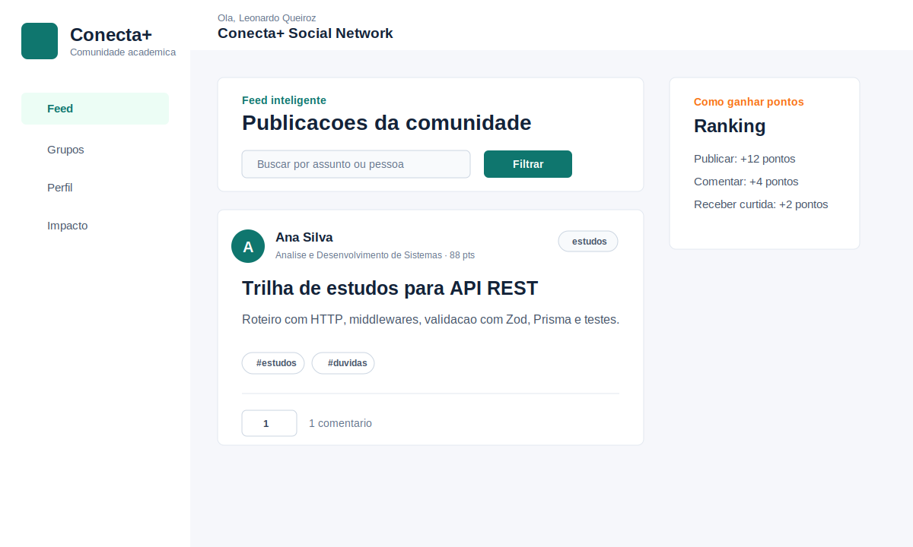
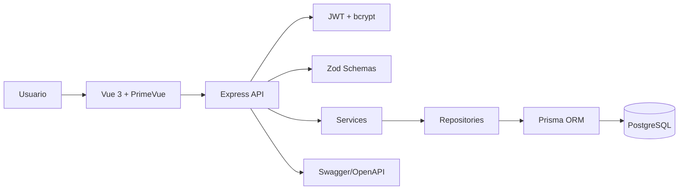
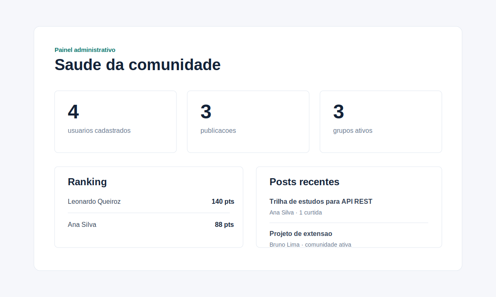

# Conecta+

Conecta+ e uma rede social academica e comunitaria que desenvolvi para organizar, em um unico ambiente, duvidas, projetos, oportunidades, materiais e grupos de estudo.

A ideia foi construir uma entrega full stack objetiva, demonstravel e facil de executar, usando Vue 3, TypeScript, PrimeVue, Tailwind CSS, Pinia e Vue Router no frontend; Node.js, Express, TypeScript, Prisma, PostgreSQL, Zod, JWT e bcrypt no backend.

## Proposta

Ao observar que muitas conversas academicas ficam perdidas em grupos e arquivos soltos, organizei o Conecta+ como um produto simples: feed por categorias, perfis, ranking de colaboracao, comentarios, curtidas e grupos de estudo.

## Funcionalidades

- Cadastro, login e sessao protegida com JWT.
- Perfil de usuario com curso, bio, avatar e pontuacao.
- Edicao de perfil com upload de foto ou escolha de avatares prontos.
- Feed de publicacoes com busca, filtro por categoria e tags.
- CRUD de posts para autores autenticados, com moderacao por administrador.
- Comentarios editaveis/removiveis e curtidas com alternancia entre curtir e descurtir.
- Tags iniciais: `#estudos`, `#projetos`, `#emprego` e `#duvidas`.
- Modo comunidade com grupos de estudo e participacao.
- Painel administrativo com indicadores, posts recentes e usuarios ativos.
- Dark mode persistente.
- Pagina "Sobre o projeto e impacto social".
- Swagger/OpenAPI em `/docs`.
- Seed de dados para demonstracao.
- Docker Compose para frontend, backend e banco.

## Decisoes de Projeto

- Escolhi Vue 3 com TypeScript porque queria uma interface reativa, componentizada e mais segura durante a evolucao do projeto.
- Usei PrimeVue e Tailwind CSS juntos para acelerar a criacao dos componentes sem abrir mao de ajustes visuais finos e responsividade.
- Optei por Express no backend por ser uma base simples, direta e adequada para uma API REST de hackathon, mantendo o codigo facil de explicar.
- Modelei o banco com Prisma e PostgreSQL para ter relacoes claras, migrations versionadas e consultas mais previsiveis.
- Implementei JWT com bcrypt para separar autenticacao, protecao de rotas e armazenamento seguro de senha.
- Mantive Docker Compose como caminho principal de execucao para que frontend, API e banco subam de forma reproduzivel em uma unica etapa.
- Organizei o backend em rotas, controllers, services, repositories e schemas Zod para deixar evidente onde ficam entrada HTTP, regra de negocio, acesso a dados e validacao.

## Arquitetura





## Organizacao

```text
apps/
  api/
    prisma/              schema e seed
    src/
      controllers/       entrada HTTP
      services/          regras de negocio
      repositories/      acesso a dados
      routes/            rotas Express
      schemas/           validacoes Zod
      middlewares/       autenticacao e erros
      dto/               tipos de transferencia
  web/
    src/
      components/        layout e componentes reutilizaveis
      pages/             telas principais
      router/            rotas Vue
      services/          cliente HTTP
      stores/            estado Pinia
```

## Como executar localmente

1. Instale as dependencias:

```bash
npm install
```

2. Copie as variaveis de ambiente:

```bash
cp .env.example apps/api/.env
cp .env.example apps/web/.env
```

3. Suba o PostgreSQL:

```bash
docker compose up -d postgres
```

4. Gere o cliente Prisma e rode as migrations:

```bash
npm run db:generate
npm run db:migrate
```

5. Popule a base de demonstracao:

```bash
npm run seed
```

6. Execute a aplicacao:

```bash
npm run dev
```

Frontend: `http://localhost:5173`

API: `http://localhost:3333/api`

Swagger: `http://localhost:3333/docs`

## Docker completo

```bash
docker compose up --build
```

Frontend: `http://localhost:8081`

API: `http://localhost:3333/api`

## Acesso de demonstracao

Administrador:

- E-mail: `admin@conectamais.edu`
- Senha: `Conecta@123`

Usuario:

- E-mail: `ana@conectamais.edu`
- Senha: `Conecta@123`

## Endpoints principais

| Metodo | Rota | Descricao |
| --- | --- | --- |
| POST | `/api/auth/register` | Cria conta |
| POST | `/api/auth/login` | Autentica usuario |
| GET | `/api/auth/me` | Retorna usuario autenticado |
| GET | `/api/posts` | Lista feed com filtros |
| POST | `/api/posts` | Cria publicacao |
| PUT | `/api/posts/:id` | Atualiza publicacao |
| DELETE | `/api/posts/:id` | Remove publicacao |
| POST | `/api/posts/:id/like` | Alterna curtida |
| POST | `/api/posts/:id/comments` | Adiciona comentario |
| PUT | `/api/posts/comments/:commentId` | Atualiza comentario |
| DELETE | `/api/posts/comments/:commentId` | Remove comentario |
| GET | `/api/users/search` | Busca usuarios |
| PUT | `/api/users/me` | Atualiza perfil, bio e avatar |
| GET | `/api/groups` | Lista grupos |
| POST | `/api/groups/:id/join` | Entra ou sai de um grupo |
| GET | `/api/admin/metrics` | Indicadores administrativos |

## Inovacoes implementadas



- Ranking de colaboracao calculado para valorizar participacao real, como publicacoes, comentarios e interacoes.
- Grupos de estudo como camada comunitaria alem do feed.
- Feed com filtros por categoria, busca textual e tags academicas.
- Conteudo gerenciavel pelo proprio usuario, com edicao, exclusao e moderacao para simular um fluxo mais proximo de uma rede social real.
- Perfil personalizavel com avatar gerado ou foto enviada pelo estudante.
- Painel administrativo para leitura rapida de saude da comunidade.
- UX com dark mode e interface responsiva voltada para apresentacao de hackathon.

## Pitch

Link do pitch: [video_pitch_final_com_audio.mp4](https://github.com/leoqeiroz-cell/conecta-plus-social-network/raw/main/docs/pitch/video_pitch_final_com_audio.mp4)

O video apresenta o raciocinio da solucao, a demonstracao real do produto, os recursos de colaboracao, o painel administrativo, a documentacao da API e o impacto social academico.

## Evolucao do Projeto

- `56d2d8c`: implementacao inicial da rede social Conecta+.
- `723b325`: aprimoramento da validacao tecnica e da documentacao da entrega.
- `b1ced19`: adicao de gerenciamento de conteudo, comentarios e perfil editavel.
- `6a44fa1`: inclusao do video final do pitch no repositorio e atualizacao do README.
- Atualizacao final: refinamento do README e do relatorio com as decisoes tecnicas do projeto.

Sugestao de roteiro:

1. Problema: conhecimento academico se perde em canais dispersos.
2. Solucao: Conecta+ organiza duvidas, projetos, materiais e grupos.
3. Demonstracao: login, feed, post, comentario, curtida, grupos e ranking.
4. Impacto: mais colaboracao, acolhimento e aprendizagem entre estudantes.

## Qualidade

```bash
npm run lint
npm run test
npm run build
```

O projeto prioriza arquitetura em camadas, validacao de entrada, separacao de responsabilidades, documentacao de API e experiencia de uso consistente.
